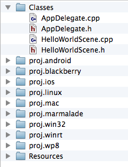
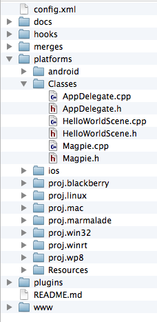
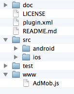
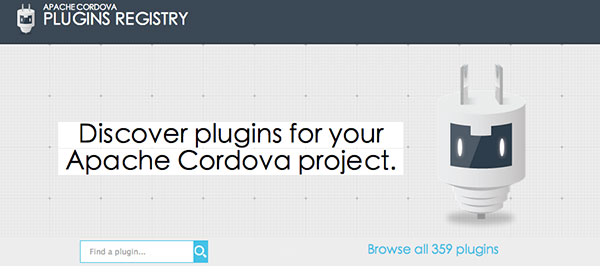

# Magpie = Cocos2d-X + Cordova Plugins #

Framework for Cocos2d-X C++ based game to call hundreds of Cordova/PhoneGap plugins

Taking advantage of both projects:
* Cocos2d-X, the most popular open source game engine. Develop game with C++/javascript/lua, hardware acceleration with OpenGL, excellent performance.
* Cordova, **hundreds of existing plugins** to access native functionalities and 3rd party SDKs.

>Note: it's NOT a plugin for normal Cordova/PhoneGap app, but a plugin framework for Cocos2d-X. 

# Project Status #

* [x] Framework works on Android and iOS.
* [x] Utility CLI magpie.js finished.
* [ ] Documentation and example code.

# Architecture #


# How to Use? #

Requirement: Following tools need be installed first.
* git
* node.js
* cordova

Step 1: Download Magpie Framework and CLI:

```
git clone https://github.com/HandyWit/magpie ~/magpie
```

Step 2: Migrate Cocos2d-X project and add Magpie Framework:

Usually, a cocos2d-x project is located at: COCOS2DX/projects/GameName. 

Run following commands:
```
~/magpie/cli/magpie.js /path/to/cocos2d-x/projects/GameName
```
A new project root will be created at.
```
# <project_root> = /path/to/cocos2d-x/proj_GameName
``` 

Step 3: Use Cordova CLI to add Plugins

```
cd <project_root>
cordova plugin add <plugin_id_or_path>
```

Step 4: Write C++ code to call Plugins, build and run.

# Folder Structure #

Cocos2d-X Project | After Migrate to Magpie
------------------|-----------------------
 |  

# Example Code #

This is an example to use C++ to call Cordova AdMob Plugin in Cocos2d-X game.

```c
#if(CC_TARGET_PLATFORM == CC_PLATFORM_ANDROID)
#define BANNER_ADID 		"ca-app-pub-6869992474017983/9375997553"
#define INTERSTITIAL_ADID	"ca-app-pub-6869992474017983/1657046752"
#elif(CC_TARGET_PLATFORM == CC_PLATFORM_IOS)
#define BANNER_ADID 		"ca-app-pub-6869992474017983/4806197152"
#define INTERSTITIAL_ADID	"ca-app-pub-6869992474017983/7563979554"
#endif

bool GameScene::init() {
    if ( ! BaseScene::init() ) {
        return false;
    }

    // create banner
	string args = "";
	args = args + "[{"
		"\"adId\":\"" + BANNER_ADID + "\","
		"\"isTesting\":true,"
                "\"overlap\":true,"
		"\"autoShow\":true"
		"}]";
	Magpie::instance()->execute("AdMob", "createBanner", args.c_str(), NULL, NULL);

    return true;
}

void GameScene::onGameStart() {
	string args = "";
	args = args + "[{\"adId\":\"" + INTERSTITIAL_ADID + "\", \"autoShow\":false}]";
	Magpie::instance()->execute("AdMob", "prepareInterstitial", args.c_str(), NULL, NULL);
}

void GameScene::onGameOver() {
	Magpie::instance()->execute("AdMob", "showInterstitial", "[]", NULL, NULL);
}

```

# How to know the interface? #

Here is the standard folder structure of a Cordova plugin.



README.md is the documentation for plugin. 
Example: https://github.com/floatinghotpot/cordova-admob-pro/blob/master/README.md

The .js file under www, describe the call interface, like:
```javascript
cordova.exec( successCallback, failureCallback, 'AdMob', 'createBanner', [ options ] );
```
Example: https://github.com/floatinghotpot/cordova-admob-pro/blob/master/www/AdMob.js

# Where to Get More Cordova Plugins? #

Apache Cordova Official Plugin Registry: http://plugins.cordova.io/



There are more than 300+ plugins so far, including Apache Cordova official plugins for camera, contacts, motion, etc.

# Why named "Magpie"? #

It comes from the Chinese legend, Magpie Bridge over the the Milky Way, which bring the separated lovers together.


# Credits #

Magpie project is created by Raymond Xie. (floatinghotpot @ github)

It's based on the Cordova/Phonegap Framework.


